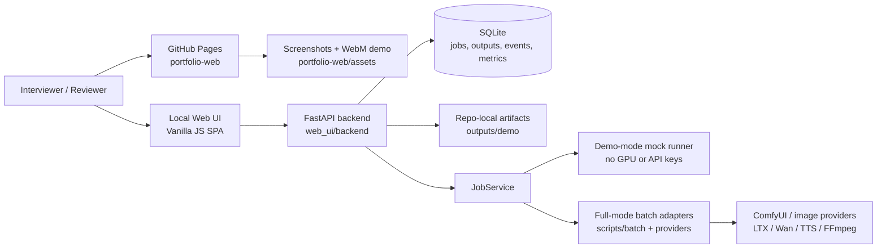
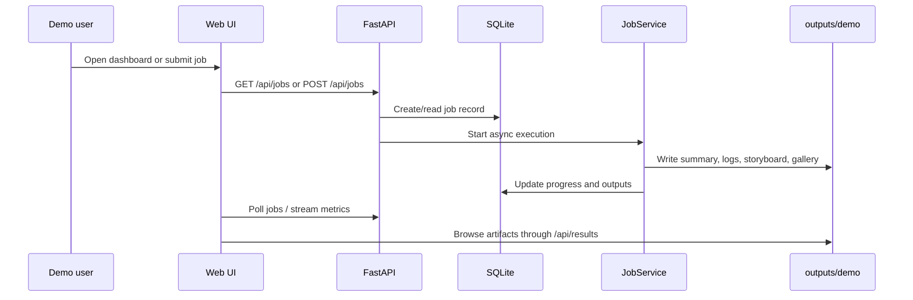
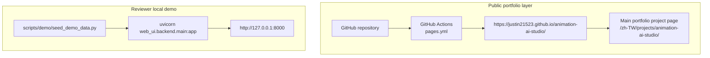
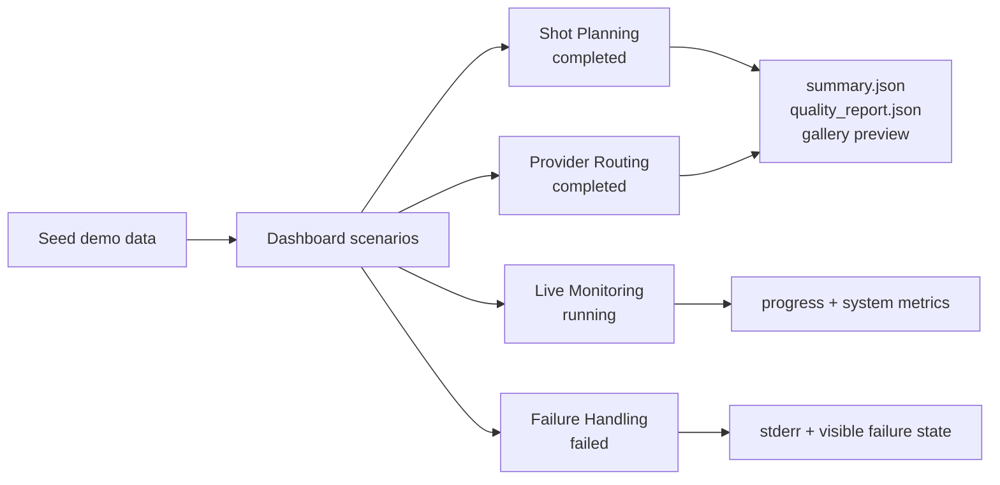

# Animation AI Studio

Animation AI Studio is a portfolio-ready AI animation workflow platform. It turns a research-heavy local animation pipeline into a demoable product surface for shot planning, generation job orchestration, realtime monitoring, artifact browsing, and interview walkthroughs.

The repository supports two modes:

- **Demo mode:** deterministic, repo-local sample data and mock execution. No private API keys, model weights, GPU, or `/mnt/data` dependency required.
- **Full mode:** integration path for the existing batch scripts, ComfyUI/action workflows, image providers, video providers, TTS, FFmpeg, and project-oriented `studio/` CLI.

## Demo Entry Points

- Static portfolio page: `portfolio-web/index.html`
- Public GitHub Pages target: `https://justin21523.github.io/animation-ai-studio/`
- Interactive Web UI: `web_ui/frontend/`, served by FastAPI
- Demo config: `configs/web_ui/demo.yaml`
- Demo data seeder: `scripts/demo/seed_demo_data.py`
- One-command local runner: `scripts/demo/run_web_ui_demo.sh`
- Public media assets: `portfolio-web/assets/screenshots/` and `portfolio-web/assets/video/demo-walkthrough.webm`

## What This Demo Shows

- Queue-backed jobs with completed, running, and failed states
- FastAPI endpoints for health, jobs, stats, results, actions, images, and system metrics
- SQLite job database with outputs, logs, events, and metrics tables
- Result browser over repo-local artifacts under `outputs/demo`
- Realtime progress events and system monitoring surface
- Portfolio landing page deployable with GitHub Pages
- Clear separation between demo-safe mock flow and full GPU/API runtime flow

## Architecture

### System Map



### Runtime Data Flow



### Deployment Topology



```text
portfolio-web/
  Static portfolio landing page for GitHub Pages

web_ui/
  FastAPI backend + vanilla JavaScript frontend
  backend/api/       health, jobs, stats, results, system, action, image
  backend/db/        SQLite schema and operations
  backend/services/  job orchestration and demo-mode runner
  frontend/          dashboard, jobs, results, monitor pages

studio/
  Project-oriented animation architecture and CLI

scripts/
  Existing generation, action, audio, training, orchestration, and batch scripts

configs/
  Demo and full-mode runtime configuration
```

### Functional Coverage

| Area | Demo status | Implementation surface | Notes |
| --- | --- | --- | --- |
| Portfolio landing | Complete | `portfolio-web/` | Public GitHub Pages site with screenshots and video |
| Job dashboard | Complete | `web_ui/frontend/js/components/job-list.js` | Shows completed, running, failed, and newly submitted jobs |
| Mock-safe execution | Complete | `JobService._execute_demo_job` | Deterministic artifacts, no model weights or API keys |
| Artifact browser | Complete | `/api/results/*` + ResultBrowser | Browses repo-local `outputs/demo` safely |
| System monitor | Complete | `/api/system/*` + SSE | CPU/RAM/GPU/disk cards and chart |
| Stats API | Complete | `/api/stats/*` | Portfolio summary and chart-ready aggregates |
| Full GPU/model pipeline | Partial | `scripts/`, providers, ComfyUI paths | Requires local models, credentials, and runtime setup |

## Quick Start

Use Python 3.11+ from the repository root.

```bash
pip install -r requirements/web_ui.txt
scripts/demo/run_web_ui_demo.sh
```

Open:

```text
http://127.0.0.1:8000
```

Useful API checks:

```bash
curl http://127.0.0.1:8000/api/health
curl http://127.0.0.1:8000/api/jobs?limit=5
curl http://127.0.0.1:8000/api/stats/summary
curl http://127.0.0.1:8000/api/results/browse
curl http://127.0.0.1:8000/api/system/metrics
```

Submit a demo-mode job:

```bash
curl -X POST http://127.0.0.1:8000/api/jobs \
  -H "Content-Type: application/json" \
  -d '{
    "film_name": "Interview Walkthrough Job",
    "pipeline_type": "cpu_only",
    "input_video_path": "demo/input.mp4",
    "output_base_dir": "outputs/demo/manual/interview-job",
    "options": {"scenario": "recording_flow"}
  }'
```

## Demo Scenarios

The seeder creates four interview-friendly scenarios:

| Scenario | State | What to show |
| --- | --- | --- |
| Shot Planning | Completed | Shot/manifest thinking and summary artifacts |
| Provider Routing | Completed | Provider abstraction and generated gallery output |
| Live Monitoring | Running | Queue state, progress stages, logs, system monitor |
| Failure Handling | Failed | Clear external-runtime failure states and logs |

### Demo Scenario Flow



## Testing

Fast sanity checks:

```bash
python -m py_compile \
  web_ui/backend/main.py \
  web_ui/backend/api/jobs.py \
  web_ui/backend/api/results.py \
  web_ui/backend/api/system.py \
  web_ui/backend/api/stats.py \
  web_ui/backend/services/job_service.py \
  web_ui/backend/db/operations.py \
  scripts/demo/seed_demo_data.py

python -m pytest -q \
  tests/generation/test_image_provider_registry.py \
  tests/generation/test_image_strategy.py \
  tests/generation/test_action_controlnet_registry.py
```

Frontend/static checks:

```bash
for f in $(rg --files web_ui/frontend/js -g '*.js'); do
  node --check "$f"
done

python scripts/demo/seed_demo_data.py --reset
WEB_UI_CONFIG_PATH=configs/web_ui/demo.yaml \
  python -m uvicorn web_ui.backend.main:app --host 127.0.0.1 --port 8000
```

Then verify:

```bash
curl http://127.0.0.1:8000/api/health
curl http://127.0.0.1:8000/api/jobs?limit=5
curl http://127.0.0.1:8000/api/results/browse
curl http://127.0.0.1:8000/api/system/metrics
```

Known full-suite caveat: parts of the existing research pipeline currently depend on fast-moving ML packages (`diffusers`, `accelerate`, `peft`) and older fixture schemas. The portfolio demo is intentionally isolated from those runtime dependencies.

## Deployment

GitHub Pages is appropriate for the static portfolio page only. This repository includes `.github/workflows/pages.yml`, which deploys `portfolio-web/` from the `main` branch.

The Pages site includes:

- Portfolio positioning and architecture summary
- Screenshot gallery captured from the runnable demo mode
- Short WebM demo walkthrough video
- Recommended interview script and local run instructions

The interactive Web UI needs a running Python process and SQLite storage, so use one of these for the full demo:

- Render or Railway for a simple FastAPI service
- Fly.io or a VM for a persistent local artifact directory
- Vercel only for the static page or if the backend is split into serverless-compatible routes

Recommended public setup:

1. GitHub Pages: portfolio landing page
2. Render/Railway: FastAPI demo mode using `configs/web_ui/demo.yaml`
3. README: link both the landing page and live backend demo

## Environment Variables

Demo mode does not require private credentials.

Full mode may require provider-specific values such as:

- `LTX_API_KEY`
- `OPENAI_API_KEY`
- ComfyUI base URL/configuration
- model paths and local GPU runtime configuration

## Interview Highlights

- Product framing: the UI presents an animation pipeline as an inspectable workflow platform.
- Backend design: FastAPI routers, SQLite persistence, job service, SSE-compatible monitoring.
- Demo engineering: deterministic seed data and mock execution make the project reviewable anywhere.
- Failure-mode clarity: missing external runtimes become visible job states with logs.
- Deployment awareness: static portfolio page is separated from the interactive Python service.

## Current Gaps And Risks

- Full GPU/model execution is not guaranteed without local model assets and provider credentials.
- Some legacy tests fail because of dependency drift and older sample project schemas.
- `outputs/` and `data/` are intentionally ignored by git, so demo data should be regenerated with the seeder.
- The portfolio page can deploy to GitHub Pages; the FastAPI demo should deploy to a server platform.

## Suggested Walkthrough

| Step | Screen | What to say |
| --- | --- | --- |
| 1 | GitHub Pages landing | This is an orchestration platform for AI animation workflows, not a single model script. |
| 2 | Jobs dashboard | The demo is seeded with completed/running/failed states so review is deterministic. |
| 3 | Job details/results | Each job writes inspectable logs, summaries, storyboard metadata, and gallery artifacts. |
| 4 | Submit demo job | Demo mode exercises queue, DB writes, progress events, and artifact generation without GPU. |
| 5 | System monitor | The same UI surface can explain CPU/GPU constraints for full local execution. |
| 6 | README architecture | Static Pages, FastAPI, SQLite, and full-mode adapters are intentionally separated. |
