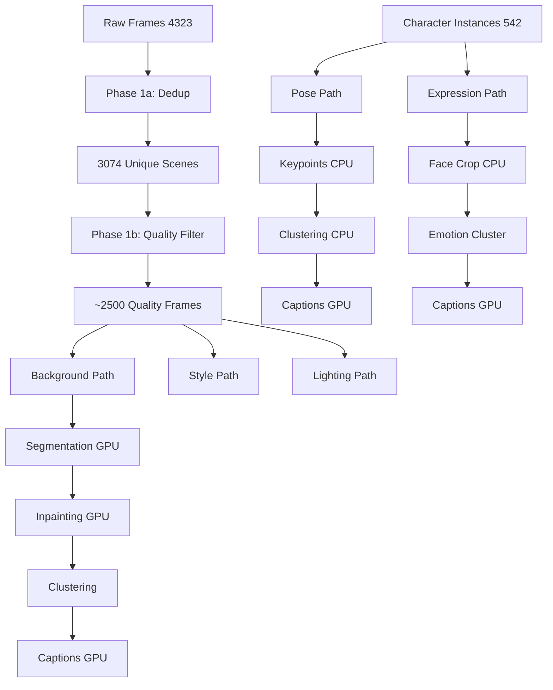

# Multi-Type LoRA Preparation Master Plan

**Project:** Luca 3D Animation LoRA Training System
**Date Created:** 2025-11-12
**Status:** Phase 1a Complete, Planning Remaining Phases

---

## Overview

This document tracks the preparation workflow for **6 types of LoRA adapters** from a single 3D animation source (Luca film). All data preparation tasks are organized by **resource requirements** (CPU-only vs GPU-required) to maximize parallel processing efficiency.

---

## LoRA Types & Data Requirements

### 1. Character LoRA (Luca Human Form) ✅ IN PROGRESS
**Purpose:** Generate consistent Luca character in various scenes
**Data Required:**
- 400+ instances of Luca (human form)
- Diverse poses, angles, expressions
- High-quality captions with character attributes

**Current Status:**
- ✅ Instance extraction complete (542 images)
- ✅ Clustering & identity filtering complete
- ✅ Manual curation complete (412 images)
- 🔄 VLM caption generation (ongoing)
- 🔄 Hyperparameter optimization (50 trials ongoing)

**Data Location:**
- Images: `/mnt/data/ai_data/datasets/3d-anime/luca/curated_dataset_v2_smart/luca_human/images/`
- Captions: `/mnt/data/ai_data/datasets/3d-anime/luca/curated_dataset_v2_smart/luca_human/captions/`

---

### 2. Background LoRA 🔄 PHASE 1A COMPLETE
**Purpose:** Generate Pixar-style Italian coastal town backgrounds
**Data Required:**
- 1000-1500 unique background scenes
- Character-free clean backgrounds
- Scene diversity (indoor/outdoor, day/night, weather)

**Preparation Phases:**

#### Phase 1a: Scene Deduplication (CPU) ✅ COMPLETE
- **Status:** COMPLETE (2025-11-12)
- **Input:** 4323 sampled frames
- **Output:** 3074 unique scenes (28.8% dedup rate)
- **Location:** `/mnt/data/ai_data/datasets/3d-anime/luca/frames_deduplicated/`
- **Time Saved:** ~104 minutes in future GPU processing

#### Phase 1b: Quality Pre-filtering (CPU) ⏸️ READY TO START
**Can run NOW in parallel with GPU optimization**
- Blur detection & filtering
- Brightness/contrast quality checks
- Resolution verification
- Color histogram analysis
- **Estimated Time:** 15-20 minutes (CPU, nice -n 19)
- **Output:** `/mnt/data/ai_data/datasets/3d-anime/luca/frames_quality_filtered/`

#### Phase 2: Character Detection & Segmentation (GPU) ⏳ WAITING
**Wait until Trial 30+ or GPU becomes available**
- SAM2 instance segmentation
- Character mask generation
- Background extraction
- **Estimated Time:** 2-3 hours (GPU-intensive)
- **Output:** `/mnt/data/ai_data/datasets/3d-anime/luca/backgrounds_segmented/`

#### Phase 3: Background Inpainting (GPU) ⏳ WAITING
**Run after Phase 2 completion**
- LaMa inpainting (GPU-accelerated)
- Remove character remnants
- Quality validation
- **Estimated Time:** 1.5-2 hours
- **Output:** `/mnt/data/ai_data/datasets/3d-anime/luca/backgrounds_clean/`

#### Phase 4: Deduplication & Clustering (Light GPU) ⏳ WAITING
**Run after GPU optimization completes**
- CLIP embeddings for similarity
- Scene clustering by location/style
- Final deduplication
- **Estimated Time:** 30-45 minutes
- **Output:** `/mnt/data/ai_data/datasets/3d-anime/luca/backgrounds_clustered/`

#### Phase 5: Caption Generation (GPU) ⏳ WAITING
**Run after clustering**
- VLM captions (scene description)
- Location tags, lighting conditions
- Atmosphere & mood descriptors
- **Estimated Time:** 1-2 hours
- **Output:** `/mnt/data/ai_data/datasets/3d-anime/luca/backgrounds_training_ready/`

---

### 3. Pose LoRA ⏸️ READY FOR CPU PREP
**Purpose:** Control character body poses & actions
**Data Required:**
- 300-500 diverse character poses
- Pose keypoints & skeleton data
- Categorized by action type

**Preparation Phases:**

#### Phase 1: Pose Detection & Keypoint Extraction (CPU) ⏸️ CAN START NOW
- Use existing character instances
- RTM-Pose keypoint detection (CPU mode)
- Pose normalization & categorization
- **Source:** `/mnt/data/ai_data/datasets/3d-anime/luca/instances_reviewed/kept/`
- **Estimated Time:** 25-35 minutes (CPU)
- **Output:** `/mnt/data/ai_data/datasets/3d-anime/luca/pose_data/keypoints/`

#### Phase 2: Pose Clustering & Dataset Assembly (CPU) ⏸️ SEQUENTIAL
- Cluster by pose similarity
- Balance action categories (standing/walking/running/sitting)
- Quality filtering (occlusion removal)
- **Estimated Time:** 15-20 minutes (CPU)
- **Output:** `/mnt/data/ai_data/datasets/3d-anime/luca/pose_data/clustered/`

#### Phase 3: Pose-Aware Caption Generation (GPU) ⏳ LATER
- Add pose descriptions to captions
- Action verb + body position descriptors
- **Estimated Time:** 30-45 minutes
- **Output:** `/mnt/data/ai_data/datasets/3d-anime/luca/pose_lora_training/`

---

### 4. Expression LoRA ⏸️ READY FOR CPU PREP
**Purpose:** Control facial expressions & emotions
**Data Required:**
- 200-400 facial close-ups
- Diverse emotions (happy/sad/surprised/angry/neutral)
- High-quality face crops

**Preparation Phases:**

#### Phase 1: Face Detection & Crop Extraction (CPU) ⏸️ CAN START NOW
- RetinaFace detection on character instances
- Face cropping with context padding
- Quality filtering (blur, occlusion, resolution)
- **Source:** `/mnt/data/ai_data/datasets/3d-anime/luca/instances_reviewed/kept/`
- **Estimated Time:** 20-30 minutes (CPU)
- **Output:** `/mnt/data/ai_data/datasets/3d-anime/luca/expression_data/faces/`

#### Phase 2: Expression Clustering (CPU + Light GPU) ⏸️ HYBRID
- Emotion classification (optional: lightweight CNN)
- Manual review interface for labeling
- Balance emotion categories
- **Estimated Time:** CPU clustering 10-15 min, manual review variable
- **Output:** `/mnt/data/ai_data/datasets/3d-anime/luca/expression_data/clustered/`

#### Phase 3: Expression Caption Generation (GPU) ⏳ LATER
- Add emotion descriptors to captions
- Facial feature details (eyes, mouth, eyebrows)
- **Estimated Time:** 25-35 minutes
- **Output:** `/mnt/data/ai_data/datasets/3d-anime/luca/expression_lora_training/`

---

### 5. Style LoRA 📋 PLANNING ONLY
**Purpose:** Maintain Pixar 3D animation style consistency
**Data Required:**
- 500-800 diverse high-quality frames
- Focus on rendering quality, not content
- Shader/material/lighting examples

**Preparation Strategy:**
- Reuse quality-filtered scene frames
- No character isolation needed
- Focus on style-specific captioning
- **Estimated Total Time:** Mostly reuses existing data + 1-2 hours captioning

---

### 6. Lighting LoRA 📋 PLANNING ONLY
**Purpose:** Control scene lighting & atmosphere
**Data Required:**
- 400-600 frames categorized by lighting condition
- Time of day (morning/noon/afternoon/evening/night)
- Weather (sunny/cloudy/rainy)
- Indoor vs outdoor lighting

**Preparation Strategy:**
- Reuse background-segmented scenes
- Automatic lighting classification (histogram analysis - CPU)
- Lighting-focused captions
- **Estimated Total Time:** 30 min classification (CPU) + 1 hour captioning (GPU)

---

## Resource Optimization Strategy

### Current System Status (2025-11-12)
- **GPU:** Fully occupied with hyperparameter optimization (50 trials)
- **CPU:** Mostly idle (~10-20% usage)
- **Memory:** 64GB available
- **Disk:** 2TB+ free on /mnt/data

### Parallel Processing Plan

#### IMMEDIATE: CPU-Only Tasks (Can Start Now)
1. ✅ **Background Phase 1a** - Scene deduplication (COMPLETE)
2. ⏸️ **Background Phase 1b** - Quality pre-filtering (READY)
3. ⏸️ **Pose Phase 1** - Keypoint extraction (READY)
4. ⏸️ **Pose Phase 2** - Pose clustering (READY)
5. ⏸️ **Expression Phase 1** - Face detection & cropping (READY)
6. ⏸️ **Lighting Classification** - Histogram-based categorization (READY)

#### LATER: Light GPU Tasks (Trial 30+ or Low GPU Load)
- CLIP embeddings for clustering
- Lightweight CNN inference (emotion classification)
- Background segmentation (SAM2 optimized)

#### FINAL: GPU-Intensive Tasks (After Optimization Complete)
- LaMa inpainting
- VLM caption generation (all types)
- Final quality checks

---

## Execution Priority & Timeline

### Week 1: CPU Preparation (During GPU Optimization)
**Day 1-2 (Now):**
- ✅ Background Phase 1a (COMPLETE)
- 🔄 Launch Background Phase 1b
- 🔄 Launch Pose Phase 1 & 2
- 🔄 Launch Expression Phase 1

**Day 3-4:**
- Monitor CPU task completion
- Manual review for Expression clustering
- Lighting classification
- Prepare GPU task queue

**Day 5-7:**
- GPU optimization completes (expected)
- Begin GPU-intensive phases
- Background segmentation & inpainting
- Caption generation for all types

### Week 2: GPU Processing & Training
**Day 8-10:**
- Complete all VLM caption generation
- Finalize all datasets
- Begin parallel LoRA training

**Day 11-14:**
- Train all 6 LoRA types
- Checkpoint evaluation
- Model composition testing

---

## Data Flow & Dependencies



---

## File Naming Conventions

### Background LoRA
- Images: `bg_scene{id}_{location}_{time}.jpg`
- Captions: `bg_scene{id}_{location}_{time}.txt`
- Example: `bg_scene0042_piazza_noon.jpg`

### Pose LoRA
- Images: `pose_{character}_{action}_{angle}_{id}.jpg`
- Captions: `pose_{character}_{action}_{angle}_{id}.txt`
- Example: `pose_luca_running_side_0023.jpg`

### Expression LoRA
- Images: `expr_{character}_{emotion}_{intensity}_{id}.jpg`
- Captions: `expr_{character}_{emotion}_{intensity}_{id}.txt`
- Example: `expr_luca_happy_high_0015.jpg`

### Style LoRA
- Images: `style_pixar_scene{id}.jpg`
- Captions: `style_pixar_scene{id}.txt`

### Lighting LoRA
- Images: `light_{condition}_{time}_{id}.jpg`
- Captions: `light_{condition}_{time}_{id}.txt`
- Example: `light_sunny_afternoon_0089.jpg`

---

## Monitoring & Checkpoints

### Progress Tracking Files
- `/mnt/data/ai_data/datasets/3d-anime/luca/preparation_progress.json`
- Updated after each phase completion
- Tracks: phase status, file counts, timestamps, errors

### Quality Reports
- Generated after each phase
- Saved in respective output directories
- Contains: statistics, sample previews, error logs

### Manual Review Points
1. After Expression clustering (emotion labeling)
2. After Background clustering (location/scene verification)
3. After all caption generation (quality check)

---

## Commands Reference

### Launch CPU Tasks in Parallel

```bash
# Background Quality Filtering
nohup bash /mnt/c/AI_LLM_projects/3d-animation-lora-pipeline/scripts/workflows/phase1b_quality_filtering.sh > /tmp/phase1b.log 2>&1 &

# Pose Keypoint Extraction
nohup bash /mnt/c/AI_LLM_projects/3d-animation-lora-pipeline/scripts/workflows/pose_preparation.sh > /tmp/pose_prep.log 2>&1 &

# Expression Face Extraction
nohup bash /mnt/c/AI_LLM_projects/3d-animation-lora-pipeline/scripts/workflows/expression_preparation.sh > /tmp/expr_prep.log 2>&1 &

# Lighting Classification
nohup bash /mnt/c/AI_LLM_projects/3d-animation-lora-pipeline/scripts/workflows/lighting_classification.sh > /tmp/lighting.log 2>&1 &
```

### Monitor Progress
```bash
# Check all CPU tasks
ps aux | grep -E "phase1b|pose_prep|expr_prep|lighting" | grep -v grep

# View logs
tail -f /tmp/phase1b.log
tail -f /tmp/pose_prep.log
tail -f /tmp/expr_prep.log
tail -f /tmp/lighting.log

# Check progress JSON
cat /mnt/data/ai_data/datasets/3d-anime/luca/preparation_progress.json | jq .
```

---

## Expected Output Summary

| LoRA Type | Dataset Size | Prep Time (CPU) | Prep Time (GPU) | Total |
|-----------|--------------|-----------------|-----------------|-------|
| Character | 412 images | N/A (done) | 1-2 hrs (caps) | 1-2 hrs |
| Background | 1000-1500 | 30-40 min | 3-5 hrs | 3.5-5.5 hrs |
| Pose | 300-500 | 40-55 min | 30-45 min | 1-1.5 hrs |
| Expression | 200-400 | 20-30 min | 25-35 min | 45-65 min |
| Style | 500-800 | Reuse data | 1-2 hrs (caps) | 1-2 hrs |
| Lighting | 400-600 | 30 min | 1 hr (caps) | 1.5 hrs |
| **TOTAL** | **2800-4200** | **~2-3 hrs** | **6-10 hrs** | **8-13 hrs** |

**Net Time Saved by Parallel CPU Processing:** ~2-3 hours

---

## Notes & Best Practices

1. **Always run CPU tasks with `nice -n 19`** to avoid interfering with GPU
2. **Use absolute paths** in all scripts
3. **Create incremental backups** before destructive operations
4. **Log everything** to `/tmp/` for debugging
5. **Check disk space** before starting large operations
6. **Manual review checkpoints** are critical for quality
7. **Keep raw data** until final LoRA training validates quality

---

## Version History

- **v1.0** (2025-11-12): Initial master plan created
  - Phase 1a Background deduplication complete
  - Identified 6 CPU-ready tasks
  - Estimated 2-3 hours of parallel CPU prep time available

---

## Next Actions (Immediate)

1. ✅ Create this master plan document
2. 🔄 Create CPU task scripts for immediate execution:
   - `phase1b_quality_filtering.sh`
   - `pose_preparation.sh`
   - `expression_preparation.sh`
   - `lighting_classification.sh`
3. 🔄 Launch all 4 CPU tasks in parallel
4. 🔄 Set up progress monitoring dashboard
5. ⏳ Wait for GPU optimization milestone before GPU tasks
