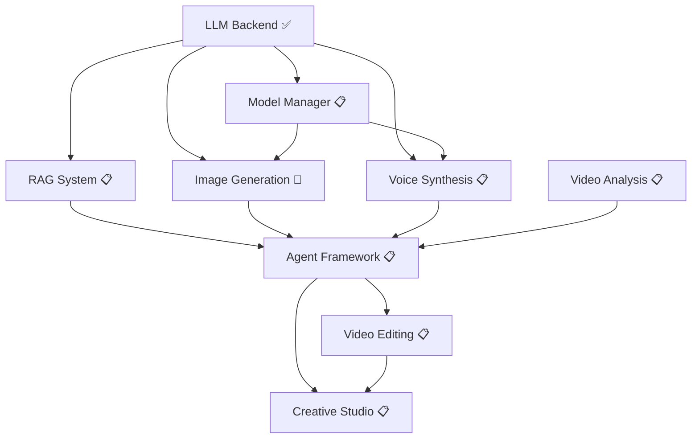

# Animation AI Studio - Module Progress

**Purpose:** Track implementation progress for all project modules
**Last Updated:** 2025-11-17
**Overall Completion:** 20% (2 of 9 modules complete/in-progress)

---

## 📊 Module Status Overview

```
Module Completion Status:

✅ LLM Backend           [████████████████████] 100%
🔄 Image Generation      [███░░░░░░░░░░░░░░░░░]  15%
📋 Voice Synthesis       [░░░░░░░░░░░░░░░░░░░░]   0%
📋 Model Manager         [░░░░░░░░░░░░░░░░░░░░]   0%
📋 RAG System            [░░░░░░░░░░░░░░░░░░░░]   0%
📋 Agent Framework       [░░░░░░░░░░░░░░░░░░░░]   0%
📋 Video Analysis        [░░░░░░░░░░░░░░░░░░░░]   0%
📋 Video Editing         [░░░░░░░░░░░░░░░░░░░░]   0%
📋 Creative Studio       [░░░░░░░░░░░░░░░░░░░░]   0%

Status Legend:
✅ Complete   🔄 In Progress   📋 Planned   ⏸️ Blocked   ❌ Failed
```

### Module Dependencies



---

## ✅ Module 1: LLM Backend (COMPLETE)

**Status:** ✅ Complete (100%)
**Completion Date:** 2025-11-16
**Lines of Code:** ~5,900
**Files Created:** 34

### Purpose

Self-hosted vLLM inference backend providing LLM capabilities for:
- Intent understanding
- Execution planning
- Quality evaluation
- Prompt engineering
- Vision-language tasks

### Deliverables

- ✅ vLLM service configurations (Qwen2.5-VL-7B, Qwen2.5-14B, Qwen2.5-Coder-7B)
- ✅ FastAPI Gateway with OpenAI-compatible API
- ✅ Redis caching layer
- ✅ Docker orchestration (single GPU, dynamic model switching)
- ✅ PyTorch 2.7.0 native SDPA configuration
- ✅ Application-layer LLM client
- ✅ Management scripts (start, stop, switch, health, logs)
- ✅ Monitoring (Prometheus, Grafana)
- ✅ Complete documentation

### Performance Metrics

| Model | Speed | VRAM | Latency |
|-------|-------|------|---------|
| Qwen2.5-VL-7B | ~40 tok/s | 13.8GB | 0.8s |
| Qwen2.5-14B | ~45 tok/s | 11.5GB | 0.6s |
| Qwen2.5-Coder-7B | ~42 tok/s | 13.5GB | 0.7s |

**Model Switching:** 20-35 seconds

### Key Achievements

1. **Hardware Optimization**
   - Configured for RTX 5080 16GB (single GPU)
   - Used appropriate small models (7B/14B)
   - Conservative GPU memory utilization (0.85)

2. **PyTorch Compatibility**
   - Enforced PyTorch 2.7.0 + CUDA 12.8
   - Native SDPA attention (xformers forbidden)
   - Documented critical environment variables

3. **Resource Management**
   - Unified AI Warehouse paths
   - Shared cache across projects
   - Prevented resource duplication

### Documentation

- [llm-backend-completion.md](llm-backend-completion.md) - Complete implementation report
- [../architecture/llm-backend.md](../architecture/llm-backend.md) - Architecture details
- [../reference/hardware-optimization.md](../reference/hardware-optimization.md) - VRAM management

### Key Files

```
llm_backend/
├── gateway/          # FastAPI Gateway + Redis
├── services/         # vLLM configurations
├── docker/           # Docker orchestration
└── scripts/          # Management scripts

scripts/core/llm_client/  # Application client
requirements/llm_backend.txt  # Dependencies
```

---

## 🔄 Module 2: Image Generation (IN PROGRESS)

**Status:** 🔄 In Progress (15%)
**Started:** 2025-11-17
**Estimated Lines of Code:** ~3,500
**Estimated Files:** 15-20

### Purpose

SDXL-based 3D character image generation with:
- LoRA character/style adapters
- ControlNet guided generation
- Character consistency validation
- Batch processing

### Deliverables

#### Core Components
- [ ] SDXL base integration (FP16, PyTorch SDPA)
- [ ] LoRA loading system (character, background, style)
- [ ] ControlNet guided generation (OpenPose, Depth, Canny)
- [ ] Character consistency validation (ArcFace embeddings)
- [ ] Batch generation pipeline

#### Configuration
- [ ] sdxl_config.yaml
- [ ] lora_registry.yaml
- [ ] controlnet_config.yaml
- [ ] character_presets.yaml

#### Testing
- [ ] Unit tests
- [ ] Integration tests
- [ ] Performance benchmarks

### Implementation Plan

| Phase | Status | Tasks |
|-------|--------|-------|
| SDXL Base | 📋 Pending | Install deps, create pipeline manager, test basic generation |
| LoRA Integration | 📋 Pending | LoRA loader, multi-LoRA composition, character generator |
| ControlNet | 📋 Pending | OpenPose/Depth/Canny support, multi-ControlNet composition |
| Consistency | 📋 Pending | ArcFace embeddings, similarity scoring, filtering |
| Batch Processing | 📋 Pending | Batch generator, progress tracking, quality filtering |
| Testing | 📋 Pending | Tests, benchmarks, documentation |

### Performance Targets

```yaml
Latency:
  SDXL base: < 15s (30 steps)
  +LoRA: < 20s
  +ControlNet: < 25s

Quality:
  Consistency: > 0.65 similarity
  Resolution: 1024x1024

VRAM:
  Base: ~10-11GB
  +LoRA: ~11-12GB
  +ControlNet: ~13-15GB
  Peak: < 15.5GB
```

### Dependencies

- **Requires:** LLM Backend (for intent analysis, evaluation)
- **Blocks:** None
- **Integrates with:** Model Manager (VRAM switching)

### Documentation

- [image-generation.md](image-generation.md) - Complete architecture and implementation plan

### Key Files (To Create)

```
scripts/generation/image/
├── sdxl_pipeline.py
├── lora_loader.py
├── controlnet_generator.py
├── character_generator.py
├── consistency_checker.py
└── batch_generator.py

configs/generation/
├── sdxl_config.yaml
├── lora_registry.yaml
├── controlnet_config.yaml
└── character_presets.yaml
```

### Known Challenges

1. **VRAM Constraints** - Must stop LLM before loading SDXL
2. **LoRA Availability** - Character LoRAs not yet trained (LoRA pipeline at 14.8%)
3. **PyTorch Compatibility** - Must use SDPA, not xformers
4. **Character Consistency** - Maintaining identity across poses/scenes

---

## 📋 Module 3: Voice Synthesis (PLANNED)

**Status:** 📋 Planned (0%)
**Estimated Lines of Code:** ~2,500
**Estimated Files:** 10-15

### Purpose

GPT-SoVITS-based character voice synthesis:
- Text-to-speech with character voices
- Voice cloning from film audio
- Emotion control
- Multi-language support (EN, IT)

### Deliverables

#### Core Components
- [ ] GPT-SoVITS wrapper
- [ ] Voice model trainer
- [ ] Voice dataset builder (extract from films)
- [ ] Emotion controller
- [ ] Batch synthesis pipeline

#### Configuration
- [ ] tts_config.yaml
- [ ] character_voices.yaml

#### Voice Models
- [ ] Luca voice model (trained)
- [ ] Alberto voice model (trained)
- [ ] Giulia voice model (trained)

### Implementation Plan

| Phase | Status | Tasks |
|-------|--------|-------|
| GPT-SoVITS Setup | 📋 Pending | Clone repo, install deps, create wrapper |
| Voice Extraction | 📋 Pending | Whisper + Pyannote, quality filtering |
| Model Training | 📋 Pending | Training pipeline, Luca voice model |
| Emotion Control | 📋 Pending | Emotion presets, blending, transitions |
| Batch Processing | 📋 Pending | Batch synthesis, progress tracking |
| Testing | 📋 Pending | Tests, benchmarks, documentation |

### Performance Targets

```yaml
Latency:
  Short (1-2s audio): < 3s generation
  Medium (3-5s audio): < 5s generation
  Long (10s audio): < 10s generation

Quality:
  Voice similarity: > 85%
  Naturalness: > 4.0/5.0 MOS
  Emotion accuracy: Clear distinction

VRAM:
  Inference: ~3-4GB
  Training: ~8-10GB
```

### Dependencies

- **Requires:** LLM Backend (optional, for quality evaluation)
- **Blocks:** None
- **Integrates with:** Image Generation (coordinated scene creation)

### Documentation

- [voice-synthesis.md](voice-synthesis.md) - Complete architecture and implementation plan

### Key Files (To Create)

```
scripts/synthesis/tts/
├── gpt_sovits_wrapper.py
├── voice_model_trainer.py
├── voice_dataset_builder.py
├── emotion_controller.py
└── lip_sync_generator.py

configs/generation/
├── tts_config.yaml
└── character_voices.yaml
```

### Known Challenges

1. **Voice Sample Quality** - Need clean audio from films (speaker diarization)
2. **Emotion Control** - Temperature-based control is indirect
3. **Multi-language** - Quality varies by language
4. **Lip-sync Alignment** - Future integration with video generation

---

## 📋 Module 4: Model Manager (PLANNED)

**Status:** 📋 Planned (0%)
**Estimated Lines of Code:** ~800
**Estimated Files:** 3-5

### Purpose

Dynamic model loading/unloading for VRAM management:
- Only one heavy model at a time (LLM OR SDXL)
- Automatic switching between models
- VRAM monitoring and optimization
- Service orchestration

### Deliverables

- [ ] ModelManager class (dynamic loading/unloading)
- [ ] VRAM monitor
- [ ] Service controller (start/stop LLM, load/unload SDXL)
- [ ] Caching strategy (model weights, inference results)

### Implementation Plan

```python
class ModelManager:
    """
    Ensures RTX 5080 16GB VRAM constraint respected

    Rules:
    - LLM (12-14GB) XOR SDXL (13-15GB)
    - GPT-SoVITS (3-4GB) can run with either stopped
    - Switching time: 20-35 seconds
    """

    def switch_to_llm()
    def switch_to_sdxl()
    def switch_to_tts(allow_with_llm=True)
    def get_vram_usage()
```

### Performance Targets

```yaml
Switching Times:
  Stop LLM: ~5-8s
  Unload SDXL: ~2-3s
  Load SDXL: ~5-8s
  Start LLM: ~15-25s
  Total: 20-35s
```

### Dependencies

- **Requires:** LLM Backend
- **Blocks:** Image Generation, Voice Synthesis
- **Critical for:** All modules requiring dynamic model switching

### Documentation

- [../reference/hardware-optimization.md](../reference/hardware-optimization.md) - VRAM management strategies

---

## 📋 Module 5: RAG System (PLANNED)

**Status:** 📋 Planned (0%)
**Estimated Lines of Code:** ~2,000
**Estimated Files:** 8-12

### Purpose

Retrieval-Augmented Generation for context-aware operations:
- Character knowledge base
- Style guide retrieval
- Past generation history
- Film analysis database

### Deliverables

- [ ] Vector database (Chroma/FAISS)
- [ ] Embedding generation (HuggingFace)
- [ ] Document indexing pipeline
- [ ] Retrieval interface
- [ ] RAG-enhanced LLM client methods

### Key Capabilities

1. **Character Context**
   - Retrieve character descriptions
   - Past successful prompts
   - Reference images

2. **Style Retrieval**
   - Animation style guides
   - Color palettes
   - Composition patterns

3. **Generation History**
   - Track past generations
   - Quality scores
   - User preferences

### Dependencies

- **Requires:** LLM Backend
- **Blocks:** Agent Framework
- **Integrates with:** All generation modules

---

## 📋 Module 6: Agent Framework (PLANNED)

**Status:** 📋 Planned (0%)
**Estimated Lines of Code:** ~2,500
**Estimated Files:** 10-15

### Purpose

LangGraph-based autonomous agent for creative decision-making:
- LLM understands intent
- RAG retrieves context
- Agent plans execution
- Agent selects tools
- Agent iterates until quality met

### Deliverables

- [ ] LangGraph state machine
- [ ] ReAct reasoning loop
- [ ] Tool registry (standardized interfaces)
- [ ] Quality evaluation system
- [ ] Iteration logic

### Agent Capabilities

```
User Request
     ↓
LLM 理解意圖
     ↓
RAG 檢索資料 (角色、場景、過往作品)
     ↓
Agent 規劃步驟
     ↓
執行工具 (圖像、語音、剪輯)
     ↓
LLM 評估品質
     ↓
Agent 決定迭代或完成
     ↓
輸出最終作品
```

### Dependencies

- **Requires:** LLM Backend, RAG System, Image Generation, Voice Synthesis
- **Blocks:** Video Editing, Creative Studio
- **Critical:** The "brain" that orchestrates all other modules

---

## 📋 Module 7: Video Analysis (PLANNED)

**Status:** 📋 Planned (0%)

### Purpose

Analyze animated video content:
- Scene detection and segmentation
- Shot composition analysis
- Camera movement tracking
- Temporal consistency analysis

### Deliverables

- [ ] Scene detection (PySceneDetect)
- [ ] Shot composition analyzer
- [ ] Camera movement tracker
- [ ] Temporal coherence checker

### Dependencies

- **Requires:** None (standalone)
- **Blocks:** None
- **Integrates with:** Agent Framework

---

## 📋 Module 8: Video Editing (PLANNED)

**Status:** 📋 Planned (0%)

### Purpose

AI-powered video editing and parody generation:
- Automated video editing with AI decisions
- Scene understanding
- Style remix and parody
- Context-aware VFX

### Deliverables

- [ ] Decision engine for editing
- [ ] Automated video editor
- [ ] Style remix pipeline
- [ ] Parody generator

### Dependencies

- **Requires:** Agent Framework, Video Analysis
- **Blocks:** Creative Studio
- **Critical:** The "大壓軸" - AI autonomous creative video generation

---

## 📋 Module 9: Creative Studio (PLANNED)

**Status:** 📋 Planned (0%)

### Purpose

User-facing application integrating all modules:
- End-to-end creative workflows
- Parody video generator
- Multimodal analysis pipeline
- User interface

### Deliverables

- [ ] Parody video generator (自動搞笑影片)
- [ ] Multimodal analysis app
- [ ] Creative studio UI
- [ ] End-to-end testing suite

### Dependencies

- **Requires:** ALL previous modules
- **Final integration:** All capabilities in one application

---

## 📊 Overall Project Health

### Completed Modules
1. ✅ LLM Backend (100%)

### In Progress
2. 🔄 Image Generation (15%)

### Planned
3. 📋 Voice Synthesis (0%)
4. 📋 Model Manager (0%)
5. 📋 RAG System (0%)
6. 📋 Agent Framework (0%)
7. 📋 Video Analysis (0%)
8. 📋 Video Editing (0%)
9. 📋 Creative Studio (0%)

### Critical Path

```
LLM Backend (✅)
    → Model Manager (📋)
    → Image Gen (🔄) + Voice Syn (📋)
    → RAG System (📋)
    → Agent Framework (📋)
    → Video Editing (📋)
    → Creative Studio (📋)
```

---

## 🎯 Immediate Next Actions

### Priority 1: Complete Image Generation Module (Current)
1. Install SDXL dependencies
2. Implement SDXLPipelineManager with PyTorch SDPA
3. Create LoRA loading system
4. Implement ControlNet support
5. Character consistency validation
6. Testing and documentation

### Priority 2: Implement Model Manager
1. Dynamic model switching logic
2. VRAM monitoring
3. Service orchestration
4. Integration with Image Generation

### Priority 3: Voice Synthesis Module
1. GPT-SoVITS setup
2. Voice sample extraction from films
3. Train Luca voice model
4. Emotion control system

---

## 📈 Progress Metrics

### Code Statistics

| Module | Files | Lines of Code | Status |
|--------|-------|---------------|--------|
| LLM Backend | 34 | ~5,900 | ✅ Complete |
| Image Generation | ~15-20 | ~3,500 | 🔄 In Progress |
| Voice Synthesis | ~10-15 | ~2,500 | 📋 Planned |
| Model Manager | ~3-5 | ~800 | 📋 Planned |
| RAG System | ~8-12 | ~2,000 | 📋 Planned |
| Agent Framework | ~10-15 | ~2,500 | 📋 Planned |
| Video Analysis | ~8-10 | ~1,500 | 📋 Planned |
| Video Editing | ~10-15 | ~2,500 | 📋 Planned |
| Creative Studio | ~8-12 | ~2,000 | 📋 Planned |
| **TOTAL** | **~107-138** | **~23,200-24,200** | **~9% Complete** |

### Documentation Statistics

| Type | Files | Status |
|------|-------|--------|
| Module docs | 4 | ✅ Complete |
| Architecture docs | 3 | ✅ Complete |
| Guides | 1 | ✅ Complete |
| Reference | 1 | ✅ Complete |
| **TOTAL** | **9** | **100% Current** |

---

## 🔗 Related Projects

### 3D Animation LoRA Pipeline

**Location:** `/mnt/c/AI_LLM_projects/3d-animation-lora-pipeline`

**Current Status:**
- Luca SAM2 segmentation: 14.8% (2,129/14,411 frames)
- Estimated completion: ~43 hours remaining
- Next: LaMa inpainting → Batch process 6 other films

**Integration:**
- Trained LoRAs → `lora_registry.yaml` (Image Generation module)
- Character metadata → `data/films/` (shared)
- Models → AI Warehouse (shared)

---

## 📝 Success Criteria

### LLM Backend Module (✅ Achieved)
- ✅ All services pass health checks
- ✅ Model switching works (20-35s)
- ✅ Performance meets targets (30-50 tok/s)
- ✅ Documentation complete
- ✅ VRAM usage within limits (< 15GB)

### Image Generation Module (🔄 Targets)
- [ ] SDXL generates 1024x1024 in < 20s
- [ ] LoRA loading functional
- [ ] Character consistency > 0.65
- [ ] VRAM switching reliable

### Voice Synthesis Module (📋 Targets)
- [ ] Voice similarity > 85%
- [ ] Generation < 5s for 3s audio
- [ ] Emotion control functional
- [ ] Multi-language support

### Agent Framework Module (📋 Targets)
- [ ] Agent understands > 90% of intents
- [ ] RAG retrieves relevant context
- [ ] Quality evaluation accurate
- [ ] Iteration improves quality

### Creative Studio Module (📋 Targets)
- [ ] End-to-end video generation works
- [ ] Quality acceptable without manual intervention
- [ ] Performance < 5 min for 30s video
- [ ] User satisfaction

---

## 🔄 Version History

- **v0.3.0** (2025-11-17): Documentation restructured to module-based
  - Removed all time-based references (Week X-Y)
  - Created module-specific architecture docs
  - Image Generation and Voice Synthesis plans separated
  - Hardware optimization reference created

- **v0.2.0** (2025-11-16): LLM Backend complete, Image+Voice planning started
  - LLM Backend foundation complete (34 files, 5,900 LOC)
  - Week 3-4 planning finalized
  - Documentation consolidation completed

- **v0.1.0** (2025-11-16): Project initialized
  - Research completed
  - Documentation created
  - Implementation roadmap defined

---

**Last Updated:** 2025-11-17
**Overall Completion:** ~20% (based on critical path progress)
**Current Focus:** Image Generation Module (15%)
**Next Milestone:** Image Generation + Model Manager completion
