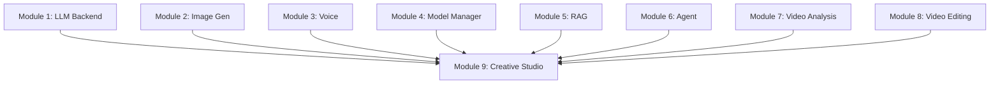

# Module 9: Creative Studio

**Complete AI-Powered Creative Content Generation Platform**

Module 9 is the final integration layer that orchestrates ALL modules for end-to-end creative workflows. This is the user-facing application layer providing autonomous creative video generation.

## 🎯 Purpose

Creative Studio integrates all 8 previous modules into cohesive workflows:
- **Module 1**: LLM Backend (decision-making, quality evaluation)
- **Module 2**: Image Generation (character images, style)
- **Module 3**: Voice Synthesis (character voices, emotion)
- **Module 4**: Model Manager (VRAM management)
- **Module 5**: RAG System (knowledge retrieval)
- **Module 6**: Agent Framework (tool orchestration)
- **Module 7**: Video Analysis (scene, composition, camera, temporal)
- **Module 8**: Video Editing (LLM decisions, parody effects, quality)

## 📁 Architecture

```
scripts/applications/creative_studio/
├── parody_video_generator.py      # Autonomous parody video generation
├── multimodal_analysis_pipeline.py # Complete multimodal analysis
├── creative_workflows.py           # Pre-defined creative workflows
├── cli.py                         # Command-line interface
├── tests/
│   └── test_creative_studio.py    # Integration test suite
└── README.md                      # This file
```

## 🔧 Components

### 1. Parody Video Generator (`parody_video_generator.py`)

**Purpose**: Autonomous funny/parody video creation - The "大壓軸"

**Complete Pipeline**:
```
1. Analyze video (Module 7)
   ↓
2. LLM creates funny edit plan (Module 8)
   ↓
3. Execute parody effects
   ↓
4. LLM evaluates quality
   ↓
5. Iterate until quality threshold met
```

**Usage**:
```python
from scripts.applications.creative_studio.parody_video_generator import ParodyVideoGenerator

generator = ParodyVideoGenerator(
    quality_threshold=0.7,
    max_iterations=3
)

# Automatic parody generation
result = await generator.generate_parody(
    input_video="luca_pasta.mp4",
    output_video="luca_funny.mp4",
    style="dramatic",        # dramatic, chaotic, wholesome
    target_duration=30.0
)

print(f"Success: {result.success}")
print(f"Quality: {result.quality_score:.3f}")
print(f"Scenes: {result.scenes_detected}")
print(f"Composition: {result.avg_composition_score:.3f}")
print(f"Iterations: {result.iterations}")
```

**Parody Styles**:
- `dramatic`: Slow motion, zoom punches, epic vibes
- `chaotic`: Rapid cuts, speed changes, meme-style
- `wholesome`: Gentle effects, feel-good vibes

**Custom Workflow**:
```python
result = await generator.custom_workflow(
    input_video="video.mp4",
    output_video="custom.mp4",
    workflow_description="Create funny compilation with zoom punches at dramatic moments"
)
```

### 2. Multimodal Analysis Pipeline (`multimodal_analysis_pipeline.py`)

**Purpose**: Comprehensive multimodal content analysis

**Modalities**:
- **Visual**: Video analysis (Module 7)
- **Audio**: Voice analysis (Module 3 - placeholder)
- **Context**: Knowledge retrieval (Module 5 - placeholder)

**Usage**:
```python
from scripts.applications.creative_studio.multimodal_analysis_pipeline import MultimodalAnalysisPipeline

pipeline = MultimodalAnalysisPipeline()

# Full multimodal analysis
result = await pipeline.analyze(
    video_path="luca.mp4",
    include_visual=True,
    include_audio=True,     # Placeholder
    include_context=True,   # Placeholder
    sample_rate=30
)

# Print summary
print(result.summary())

# Access insights
for insight in result.insights:
    print(f"• {insight}")

# Access recommendations
for rec in result.recommendations:
    print(f"→ {rec}")
```

**Visual-Only Analysis**:
```python
result = await pipeline.analyze_visual(
    video_path="video.mp4",
    sample_rate=30
)
```

**Analysis Output**:
- Scene detection results
- Composition quality scores
- Camera movement analysis
- Temporal coherence metrics
- Automated insights
- Improvement recommendations

### 3. Creative Workflows (`creative_workflows.py`)

**Purpose**: Pre-defined end-to-end creative workflows

**Available Workflows**:

#### Workflow 1: Parody Video Generation
```python
from scripts.applications.creative_studio.creative_workflows import CreativeWorkflows

workflows = CreativeWorkflows()

result = await workflows.create_parody_video(
    input_video="luca.mp4",
    output_video="luca_parody.mp4",
    style="dramatic",
    target_duration=30.0,
    quality_threshold=0.7
)

print(f"Success: {result.success}")
print(f"Outputs: {result.outputs}")
print(f"Execution Time: {result.execution_time:.1f}s")
```

#### Workflow 2: Analysis & Report
```python
result = await workflows.analyze_and_report(
    video_path="luca.mp4",
    output_report="analysis.json",
    include_visual=True,
    include_audio=False,
    include_context=False
)
```

#### Workflow 3: Custom Creative Workflow
```python
result = await workflows.custom_creative_workflow(
    workflow_description="Create 30s highlight reel with best moments",
    input_files={"video": "luca.mp4"},
    output_dir="outputs/highlights"
)
```

**List Workflows**:
```python
workflows_list = workflows.list_workflows()

for wf in workflows_list:
    print(f"{wf['name']}: {wf['description']}")
```

### 4. Command-Line Interface (`cli.py`)

**Purpose**: User-friendly CLI for all Creative Studio capabilities

#### CLI Commands

**Parody Video Generation**:
```bash
# Basic parody
python scripts/applications/creative_studio/cli.py parody \
    input.mp4 output.mp4 \
    --style dramatic

# With duration and effects
python scripts/applications/creative_studio/cli.py parody \
    luca.mp4 luca_funny.mp4 \
    --style chaotic \
    --duration 30 \
    --effects zoom_punch,speed_ramp \
    --save-result
```

**Video Analysis**:
```bash
# Visual analysis
python scripts/applications/creative_studio/cli.py analyze \
    luca.mp4 \
    --visual \
    --output analysis.json

# Multimodal analysis
python scripts/applications/creative_studio/cli.py analyze \
    luca.mp4 \
    --visual \
    --audio \
    --context \
    --sample-rate 30 \
    --output analysis.json
```

**Workflows**:
```bash
# Parody workflow
python scripts/applications/creative_studio/cli.py workflow parody \
    luca.mp4 \
    --output luca_parody.mp4 \
    --style dramatic \
    --duration 30

# Analysis workflow
python scripts/applications/creative_studio/cli.py workflow analyze \
    luca.mp4 \
    --output analysis_report.json \
    --audio \
    --context
```

**List Capabilities**:
```bash
python scripts/applications/creative_studio/cli.py list
```

**CLI Help**:
```bash
python scripts/applications/creative_studio/cli.py --help
python scripts/applications/creative_studio/cli.py parody --help
python scripts/applications/creative_studio/cli.py analyze --help
```

## 🚀 Complete Workflows

### Example 1: Automatic Funny Video Generation

```python
import asyncio
from scripts.applications.creative_studio.parody_video_generator import ParodyVideoGenerator

async def create_funny_video():
    generator = ParodyVideoGenerator()

    result = await generator.generate_parody(
        input_video="data/films/luca/scenes/pasta_discovery.mp4",
        output_video="outputs/luca_pasta_funny.mp4",
        style="dramatic",
        target_duration=30.0
    )

    if result.success:
        print(f"✅ Success! Quality: {result.quality_score:.3f}")
        print(f"📊 Scenes: {result.scenes_detected}")
        print(f"🎬 Camera: {result.camera_style}")
        print(f"🔄 Iterations: {result.iterations}")
        print(f"💬 Feedback: {result.feedback}")
    else:
        print(f"❌ Failed: {result.feedback}")

asyncio.run(create_funny_video())
```

### Example 2: Complete Analysis Pipeline

```python
import asyncio
from scripts.applications.creative_studio.multimodal_analysis_pipeline import MultimodalAnalysisPipeline

async def analyze_video():
    pipeline = MultimodalAnalysisPipeline()

    result = await pipeline.analyze(
        video_path="data/films/luca/scenes/beach_scene.mp4",
        include_visual=True,
        include_audio=False,
        include_context=False
    )

    # Print summary
    print(result.summary())

    # Save report
    pipeline.save_result(result, "outputs/beach_analysis.json")

asyncio.run(analyze_video())
```

### Example 3: Creative Workflow Orchestration

```python
import asyncio
from scripts.applications.creative_studio.creative_workflows import CreativeWorkflows

async def creative_pipeline():
    workflows = CreativeWorkflows()

    # Step 1: Analyze
    analysis = await workflows.analyze_and_report(
        video_path="luca.mp4",
        output_report="outputs/luca_analysis.json"
    )

    # Step 2: Create parody based on analysis
    parody = await workflows.create_parody_video(
        input_video="luca.mp4",
        output_video="outputs/luca_funny.mp4",
        style="dramatic"
    )

    print(f"Analysis: {analysis.success}")
    print(f"Parody: {parody.success}")

asyncio.run(creative_pipeline())
```

## 📊 Performance

**Parody Video Generation (30s video)**:
- Analysis (Module 7): ~60s
- LLM Edit Plan (Module 8): ~10-15s
- Parody Effects: ~20-40s
- Quality Evaluation: ~5s
- **Total**: ~2-3 minutes

**Multimodal Analysis (30s video)**:
- Visual Analysis: ~60s
- Audio Analysis: TBD (placeholder)
- Context Retrieval: ~1s (placeholder)
- **Total**: ~60-90s

## 🧪 Testing

Run test suite:
```bash
# All tests
python scripts/applications/creative_studio/tests/test_creative_studio.py

# Specific test class
pytest scripts/applications/creative_studio/tests/test_creative_studio.py::TestParodyVideoGenerator -v

# With coverage
pytest scripts/applications/creative_studio/tests/ --cov=scripts.applications.creative_studio
```

## 🔗 Module Integration

### Module Dependencies



**Direct Integration**:
- Module 7: Video Analysis → Analysis Pipeline
- Module 8: Video Editing → Parody Generator
- Module 6: Agent Framework → Workflow Orchestration

**Indirect Integration** (via Module 6/8):
- Module 1: LLM Backend → Decision-making
- Module 5: RAG System → Context retrieval
- Module 4: Model Manager → VRAM management

**Placeholder Integration** (for future):
- Module 2: Image Generation → Character scenes
- Module 3: Voice Synthesis → Audio analysis

## 📝 Configuration

No specific configuration needed - uses configurations from integrated modules.

## 🎬 Example Use Cases

### Use Case 1: Funny Highlight Reel
```bash
# Input: 5-minute video
# Output: 30-second funny highlight reel
python cli.py parody long_video.mp4 highlights.mp4 \
    --style chaotic \
    --duration 30 \
    --save-result
```

### Use Case 2: Quality Analysis Report
```bash
# Input: Video file
# Output: Comprehensive analysis JSON
python cli.py analyze video.mp4 \
    --visual \
    --audio \
    --output quality_report.json
```

### Use Case 3: Automated Parody Pipeline
```bash
# Input: Original video
# Output: Dramatic parody with quality guarantee
python cli.py workflow parody original.mp4 \
    --output parody.mp4 \
    --style dramatic
# Automatically iterates until quality threshold met
```

## 🚨 Troubleshooting

### Parody Generation Fails
```python
# Solution 1: Lower quality threshold
generator = ParodyVideoGenerator(quality_threshold=0.6)

# Solution 2: Increase max iterations
generator = ParodyVideoGenerator(max_iterations=5)

# Solution 3: Disable analysis for faster testing
generator = ParodyVideoGenerator(enable_analysis=False)
```

### Analysis Takes Too Long
```bash
# Solution: Reduce sample rate
python cli.py analyze video.mp4 --sample-rate 60  # Sample every 60 frames
```

### Out of VRAM
```
# Module 8 uses SAM2 (6GB VRAM)
# Make sure no other models are loaded
# Check: nvidia-smi
```

## 📚 API Reference

### ParodyVideoGenerator

```python
class ParodyVideoGenerator:
    def __init__(
        self,
        quality_threshold: float = 0.7,
        max_iterations: int = 3,
        enable_analysis: bool = True
    )

    async def generate_parody(
        self,
        input_video: str,
        output_video: str,
        style: str = "dramatic",
        target_duration: Optional[float] = None,
        effects: Optional[List[str]] = None
    ) -> ParodyGenerationResult

    async def custom_workflow(
        self,
        input_video: str,
        output_video: str,
        workflow_description: str,
        quality_threshold: Optional[float] = None
    ) -> ParodyGenerationResult
```

### MultimodalAnalysisPipeline

```python
class MultimodalAnalysisPipeline:
    def __init__(
        self,
        enable_visual: bool = True,
        enable_audio: bool = False,
        enable_context: bool = False
    )

    async def analyze(
        self,
        video_path: str,
        include_visual: bool = True,
        include_audio: bool = False,
        include_context: bool = False,
        sample_rate: int = 30
    ) -> MultimodalAnalysisResult

    async def analyze_visual(
        self,
        video_path: str,
        sample_rate: int = 30
    ) -> MultimodalAnalysisResult
```

### CreativeWorkflows

```python
class CreativeWorkflows:
    async def create_parody_video(...) -> WorkflowResult
    async def analyze_and_report(...) -> WorkflowResult
    async def custom_creative_workflow(...) -> WorkflowResult
    def list_workflows() -> List[Dict[str, str]]
```

## 📄 License

Part of Animation AI Studio - See main project LICENSE

---

**Module Status**: ✅ Complete (2025-11-17)

**Key Achievement**: Complete AI-powered creative platform integrating all 9 modules

**Next**: Project completion and deployment
